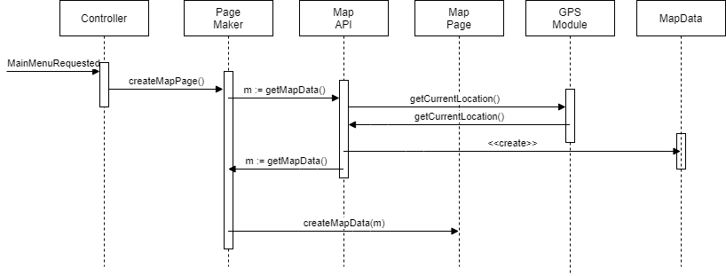
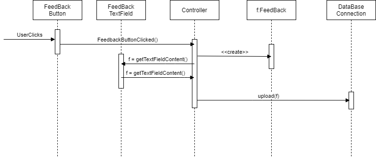
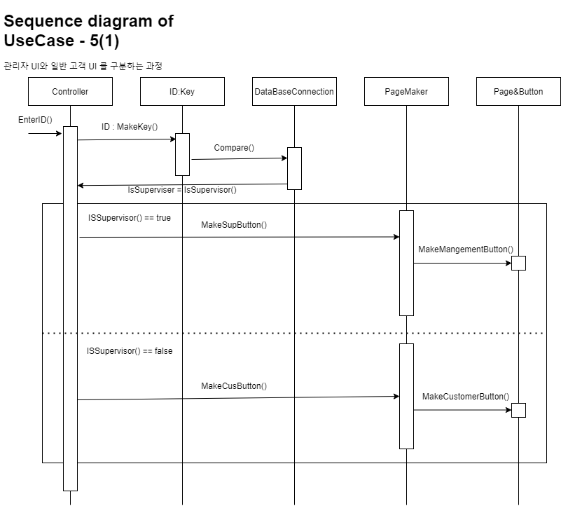
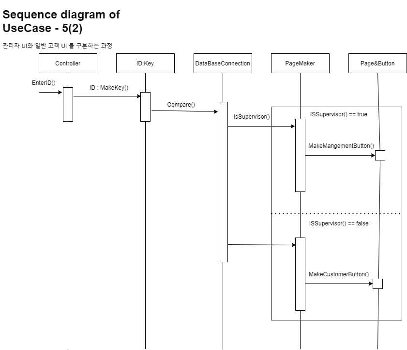
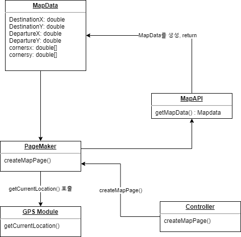
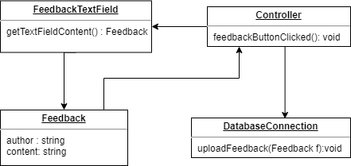
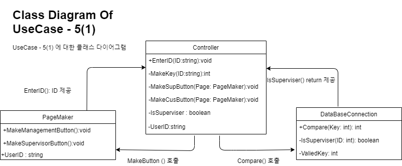
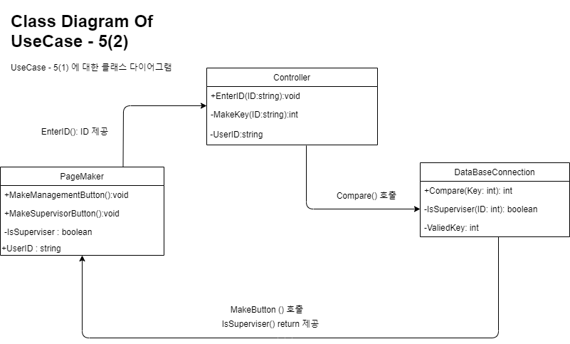

# Android Parking Booking System.지도에서_주차장 찾기  
### TEAM: 9 in SWE, CAUCSE 2021. Mapping part
* * * 

## Sequence Diagram
### UseCase 1

### UseCase 4

### UseCase 5(1)
  
### UseCase 5(2)
  

UseCase_5(1)은 Controller를 싱글톤패턴을 사용해서 구현할 가능성이 높은데 이용자가 많을 경우 Controller 객체에 부하가 걸릴 가능성과 클래스간 응집성이 과도하게 높아지는 문제가 있어서 두번째 방법으로 구현하는 것이 더 좋아보인다.

* * * 

## Class Diagram
### UseCase 1

### UseCase 4

### UseCase 5(1)
 
### UseCase 5(2)

